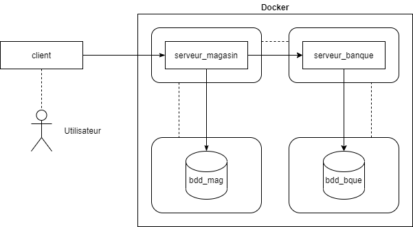
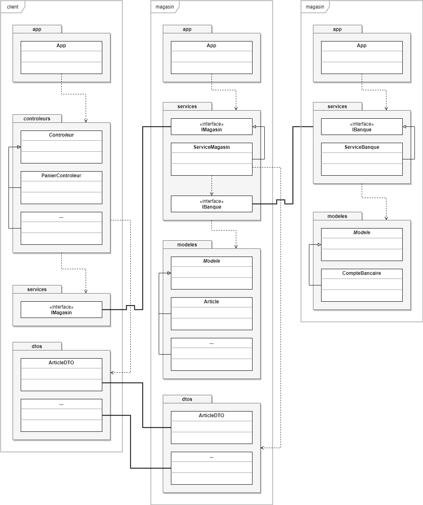
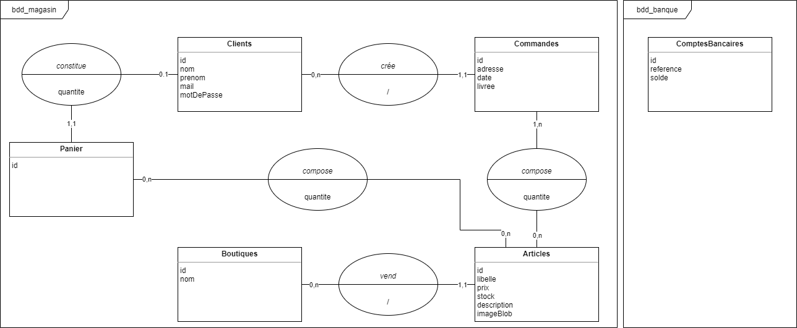

# Projet eCommerce RMI - IUTM

**Participants au projet :**

- BEER Alexis
- PYTHOUD Arnaud
- STEINMETZ Loïc

## Exécution

### Initialisation des bases de données

- Initialiser les conteneurs :

```
$ docker-compose up --build -d
```

- Supprimer les conteneurs installés :

```
$ docker stop db-magasin db-banque && docker container rm db-magasin db-banque
```

- Supprimer l'image installée :

```
$ docker image rm postgres:13
```

### Démarrage des programmes

1. Lancer l'application Banque via la classe exécutable `app.App`, dans `./banque`.
2. Lancer l'application Magasin via la classe exécutable `app.App`, dans `./magasin`.
3. Lancer l'application GUI via la classe exécutable `app.App`, dans `./client`.

### Identifiants de test

- Mail utilisateur : `john@mail.com`.
- Mot de passe : `1234`.
- Référence du compte bancaire : `123456789`.

### Connexion aux bases de données

- Base de données **BANQUE** :

```
URL : jdbc:postgresql://localhost:5400/db
UTILISATEUR : user
MOT DE PASSE : pass
```

- Base de données **MAGASIN** :

```
URL : jdbc:postgresql://localhost:5500/db
UTILISATEUR : user
MOT DE PASSE : pass
```

## Conception

### Cas d'utilisation


### Architecture générale



### Classes, Applications



### Données



#### Schémas relationnels

- Base de données **MAGASIN** :

```
Clients [id, nom, prenom, mail, motDePasse]
Commandes [id, adresse, date, livree, #idClient]
Boutiques [id, nom]
Articles [id, libelle, prix, stock, description, imageBlob]
ArticlesCommande [id, #idCommande, #idArticle, quantite]
Panier [id, #idClient]
ArticlesPanier [id, #idArticle, #idPanier, quantite]
```

- Base de données **BANQUE** :

```
ComptesBancaires [id, reference, solde]
```