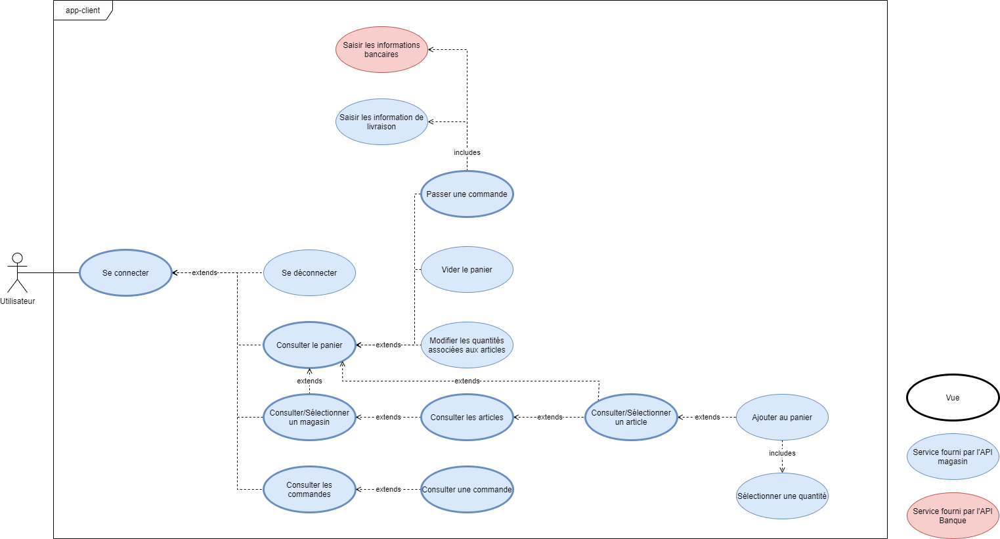
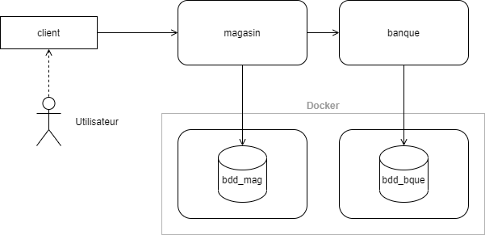

# Projet eCommerce RMI - IUTM

**Participants au projet :**

- BEER Alexis
- PYTHOUD Arnaud
- STEINMETZ Loïc

## Exécution

- Première exécution :

```
$ docker-compose up --build -d
```

- Relancer l'application : 

```
$ docker-compose up
```

- Supprimer les conteneurs installés :

```
$ docker container rm client magasin banque db-magasin db-banque
```

- Supprimer les images installées :

```
$ docker image rm ecommerce-rmi-iutm_client ecommerce-rmi-iutm_magasin ecommerce-rmi-iutm_banque
```

## Conception

### Cas d'utilisation



### Architecture générale



### Classes


### Données

